<p align="center">
  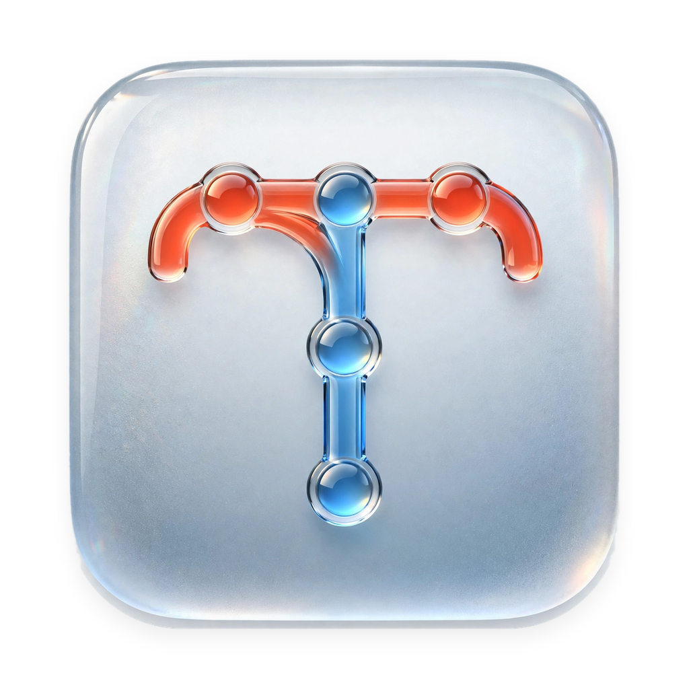
</p>

<h1 align="center">Thaigit</h1>

<p align="center">
  <b>Git client miễn phí, trực quan như GitKraken — giao diện kính cho macOS, sắp có bản Windows.</b>
</p>

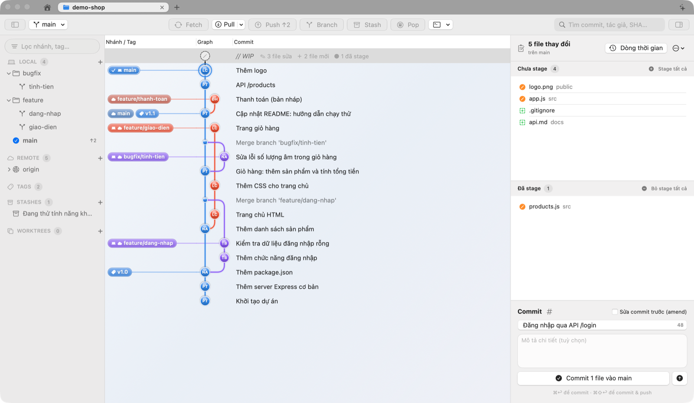

Thaigit giúp làm việc với git bằng chuột: nhìn lịch sử dạng graph nhiều màu, kéo nhánh thả lên nhánh để merge / rebase / push, stage từng dòng, giải conflict bằng vài cú bấm. Mọi thao tác gọi thẳng `git` trên máy, nên kết quả giống hệt dùng terminal — chỉ dễ nhìn và dễ bấm hơn.

| Bản | Nền tảng | Trạng thái |
| --- | --- | --- |
| Thaigit cho macOS (Swift, native) | macOS 14 trở lên | **Dùng được** — build từ mã nguồn, tự cập nhật qua GitHub Releases |
| Thaigit đa nền tảng (Tauri 2) | Windows 10/11 + macOS | **Đang phát triển** — xem [kế hoạch](plans/261002-1543-tauri-cross-platform-hermes-ai-stats/plan.md) |

## Tính năng nổi bật

### Kéo & thả như GitKraken

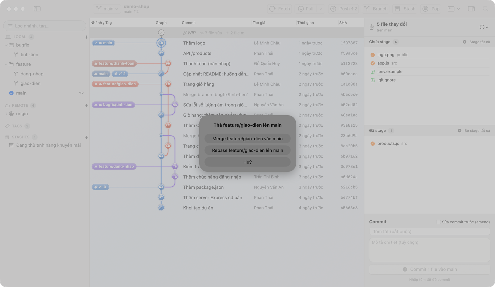

| Kéo | Thả lên | Kết quả |
| --- | --- | --- |
| Nhãn nhánh trên graph hoặc nhánh ở sidebar | Nhánh khác | Merge, rebase hoặc fast-forward |
| Nhánh local | Nhánh remote / tên remote ở sidebar | Push |
| Tag | Remote | Push tag |
| File ở mục *Chưa stage* | Mục *Đã stage* (và ngược lại) | Stage / bỏ stage |

Thả xong luôn có hộp thoại hỏi lại — không có gì chạy ngầm ngoài ý muốn.

### Stage từng dòng, không cần `git add -p`

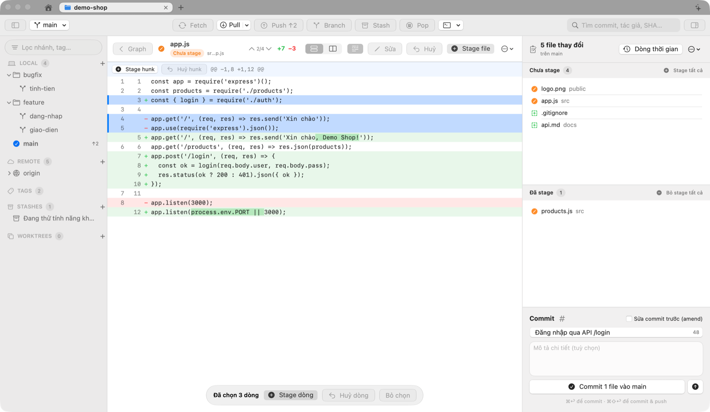

Bấm vào dòng để chọn (Shift+bấm để chọn liên tiếp), rồi **Stage dòng** / **Huỷ dòng**. Cũng làm được theo cả hunk hoặc cả file.

### Diff tách đôi và diff ảnh

<table>
  <tr>
    <td>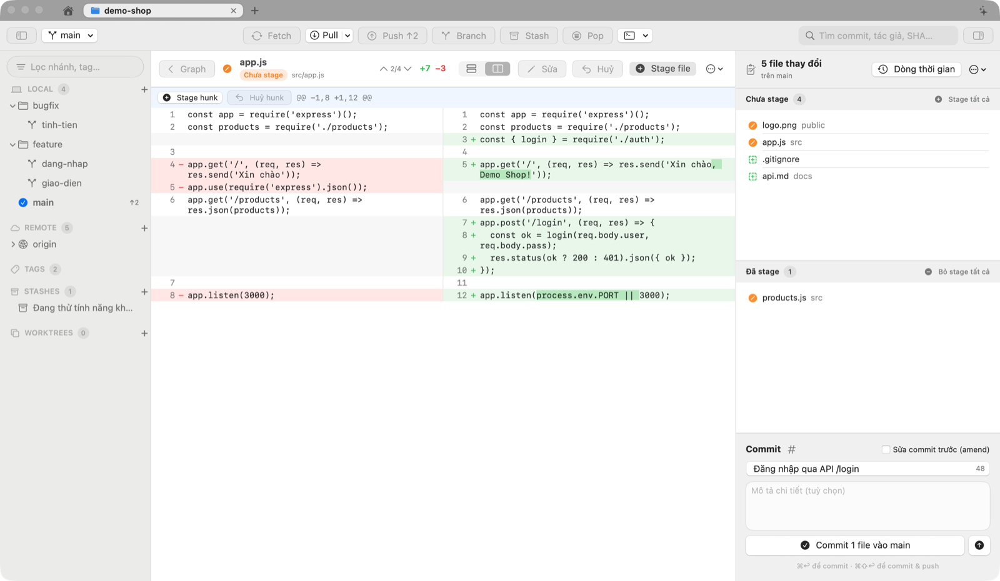</td>
    <td>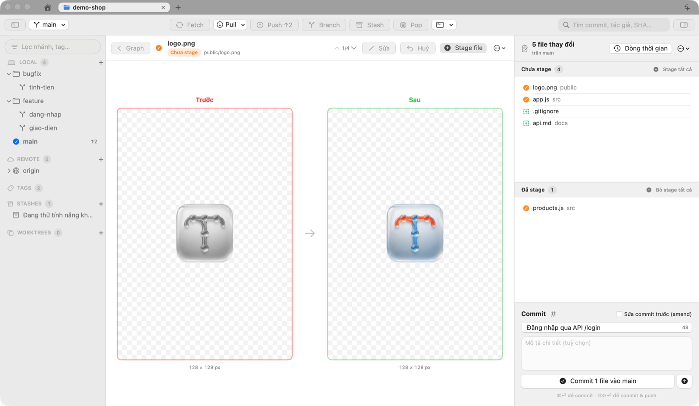</td>
  </tr>
</table>

Tô sáng đúng phần chữ thay đổi trong dòng. File ảnh hiện trước / sau cạnh nhau.

### Giải conflict bằng vài cú bấm

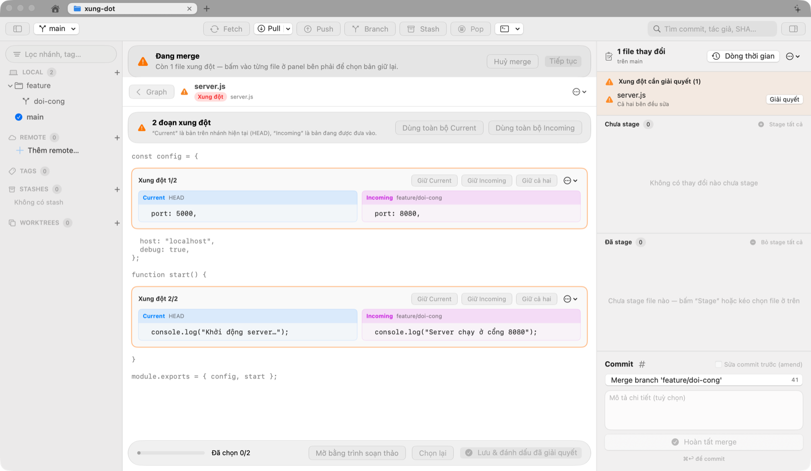

Banner báo đang merge / rebase / cherry-pick kèm nút Tiếp tục / Huỷ. Với mỗi khối xung đột chọn giữ bản hiện tại, bản kia hoặc cả hai, xem trước rồi **Lưu & đánh dấu đã giải quyết**.

### ⌘B — tìm & chuyển nhánh tức thì

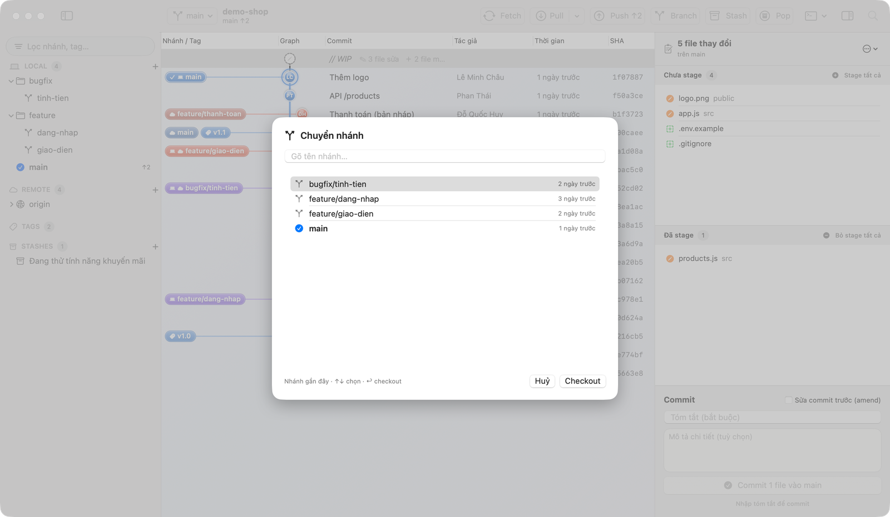

### Repo lớn vẫn mượt

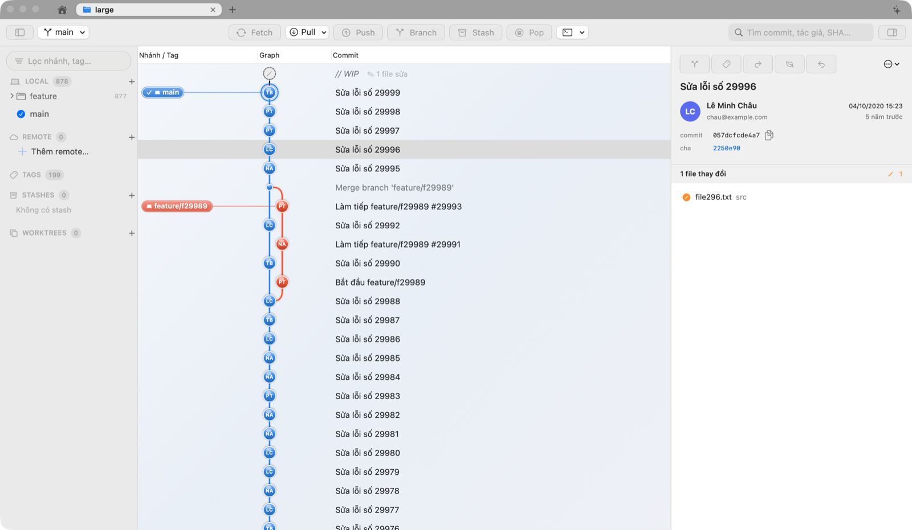

Repo thử 30.000 commit, gần 1.100 nhánh / tag: graph hiện trong khoảng 1 giây, tải thêm khi cuộn, sidebar gom nhánh theo thư mục.

### Hoàn tác mọi thao tác dễ sai

Commit, huỷ thay đổi, merge, reset, xoá nhánh, xoá stash… đều có nút **Hoàn tác** ngay trên thông báo.

### Tự cập nhật — khởi động lại là có bản mới

Thaigit tự hỏi GitHub Releases mỗi 6 giờ, tải bản mới ngầm và **kiểm chữ ký Ed25519** trước khi cài. Khi xong, góc cửa sổ hiện thẻ *"Thaigit x.y.z đã sẵn sàng"* — bấm **Khởi động lại** (hoặc cứ thoát app, lần mở sau đã là bản mới). Kiểm tra tay: menu **Thaigit → Kiểm tra cập nhật…**; tắt / bật trong Cài đặt.

### Giao diện kính, sáng & tối

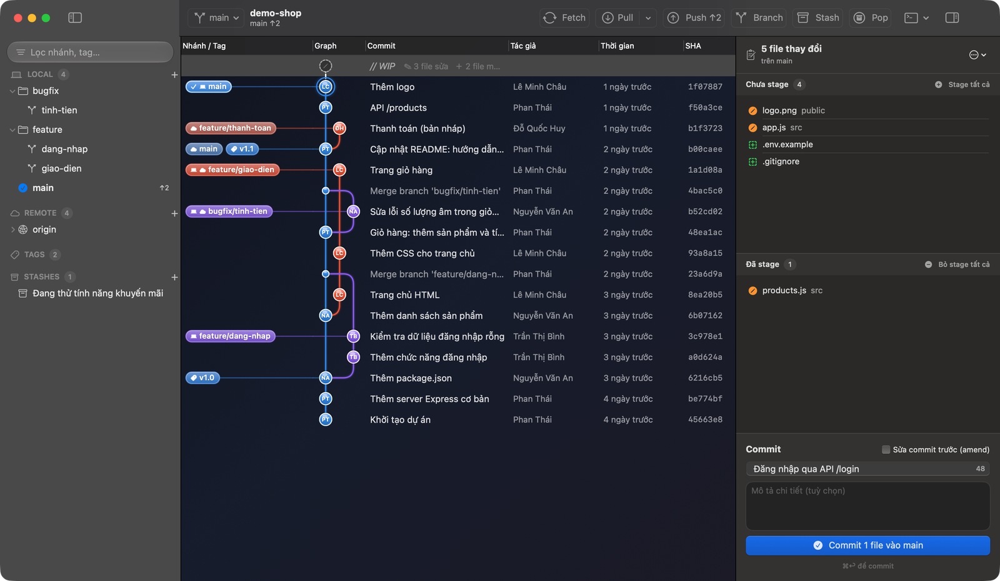

<table>
  <tr>
    <td>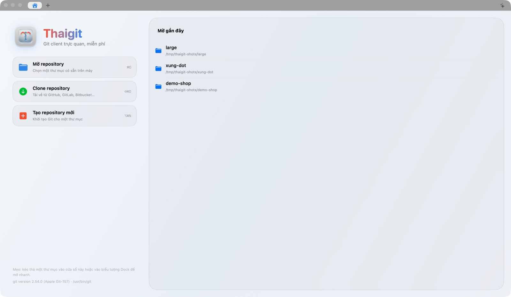</td>
  </tr>
</table>

Liquid Glass trên macOS 26 (bản cũ hơn dùng vật liệu mờ), màu lấy từ logo: thân xanh, nhánh cam đỏ của git.

## Tất cả tính năng (bản macOS)

**Graph lịch sử**
- Graph nhiều làn, mỗi làn một màu; nhãn nhánh / tag ở cột trái (💻 local, ☁️ remote).
- Dòng `// WIP` trên cùng là thay đổi chưa commit — bấm vào để stage và commit.
- Tìm commit theo nội dung, tác giả, SHA. Tải dần khi cuộn (2.000 commit mỗi lần).

**Thay đổi & commit**
- Diff gộp hoặc tách đôi, diff ảnh; stage / bỏ stage / huỷ theo file, hunk hoặc từng dòng.
- Commit, amend, ⌘↩ để commit nhanh, "Stage tất cả & commit".

**Nhánh, remote, stash, tag**
- Checkout bằng nhấp đúp; ⌘B để tìm & chuyển nhánh.
- Tạo / đổi tên / xoá nhánh, đặt upstream; fetch / pull (merge, rebase hoặc chỉ fast-forward) / push — bị từ chối thì đề xuất pull hoặc force-with-lease.
- Cherry-pick, revert, reset (soft / mixed / hard), tag, push tag.
- Stash kèm lời nhắn, apply, pop, xoá; checkout bị chặn vì có thay đổi thì có nút "Stash rồi checkout".

**Khác**
- Nhiều repo trong nhiều tab, mở gần đây, clone có tiến trình, tạo repo mới.
- Tự làm mới khi file đổi bên ngoài (sửa trong editor, commit từ terminal…), tự fetch định kỳ.
- Mở repo trong Terminal / Finder / VS Code (hoặc Cursor, Zed, Sublime), lịch sử một file, nhật ký lệnh git đã chạy.
- An toàn khi mở repo lạ: app không chạy lệnh `core.fsmonitor` do repo tự đặt.

## Cài đặt (macOS)

Yêu cầu: macOS 14 trở lên, `git`, và Xcode hoặc Command Line Tools (`xcode-select --install`).

```bash
./scripts/build-app.sh --install  # build rồi chép vào /Applications/Thaigit.app
./scripts/build-app.sh            # chỉ tạo build/Thaigit.app (bản release)
./scripts/build-app.sh --debug    # bản debug, build nhanh hơn
```

Mở thử một repo: `open -a Thaigit /đường/dẫn/repo`, hoặc kéo thư mục repo thả lên icon app.

Ghi chú:
- Máy chỉ có Command Line Tools thì script tự build bằng SDK macOS 26 (SDK macOS 27 cần plugin macro chỉ có trong Xcode). App vẫn chạy bình thường trên macOS 27.
- App được ký ad-hoc. Bản tải từ trình duyệt sang máy khác bị Gatekeeper chặn lần đầu (chuột phải → Mở, hoặc Cài đặt hệ thống → Quyền riêng tư & Bảo mật → Vẫn mở). Bản tự cập nhật không bị chặn. Phát hành rộng nên ký bằng Apple Developer ID.
- Tự cập nhật chỉ thay app nằm trong thư mục Applications.

### Xác thực khi fetch / push

- **HTTPS**: dùng credential helper của git (thường là Keychain — `git config --global credential.helper osxkeychain`). Git cần mật khẩu / token thì app hiện hộp thoại hỏi.
- **SSH**: dùng khoá trong `~/.ssh` và ssh-agent như terminal; passphrase hoặc câu hỏi xác nhận host hiện thành hộp thoại.

## Phát hành bản mới (cho người duy trì)

```bash
./scripts/release.sh 1.1.0 "Thêm blame, sửa lỗi diff ảnh" --publish
```

Script tăng phiên bản trong `Resources/Info.plist`, build, nén `Thaigit-macOS.zip` (tên cố định để trang chủ luôn trỏ tới bản mới nhất), ký bằng khoá Ed25519 trong Keychain, viết `update.json` rồi đăng cả hai lên GitHub Releases (`gh`). Máy nào đang dùng Thaigit sẽ tự tải về trong vòng 6 giờ (hoặc ngay khi bấm *Kiểm tra cập nhật…*); người dùng chỉ cần khởi động lại. Bỏ `--publish` để chỉ tạo file trong `build/release/`. Nhớ commit `Resources/Info.plist` sau khi phát hành.

- Khoá bí mật nằm trong login Keychain, mục **"Thaigit update signing key"** (tạo bằng `swift scripts/release-tool.swift generate-key`). Hãy sao lưu nó — mất khoá thì các bản đã cài không nhận được bản mới. Phát hành từ máy khác / CI: đặt biến `THAIGIT_UPDATE_PRIVATE_KEY`.
- Khoá công khai đi kèm app (`ThaigitUpdatePublicKey` trong Info.plist). App chỉ cài gói có chữ ký đúng, đúng mã ứng dụng và đúng số phiên bản ghi trong gói.

## Phím tắt

| Phím | Việc |
| --- | --- |
| ⌘O / ⇧⌘O / ⌥⌘N | Mở / clone / tạo repository |
| ⌘T | Tab mới |
| ⌘R | Làm mới |
| ⌥⌘F / ⇧⌘L / ⇧⌘P | Fetch / Pull / Push |
| ⌘B | Tìm & chuyển nhánh |
| ⇧⌘B | Tạo nhánh mới |
| ⇧⌘S / ⌥⇧⌘S | Stash / pop stash mới nhất |
| ⇧⌘A | Stage tất cả |
| ⌘↩ | Commit (khi đang gõ message) |
| ⌘0 / ⇧⌘H | Tới WIP / tới HEAD |
| ⌥⌘I | Ẩn / hiện panel chi tiết |
| ⌥⌘T / ⇧⌘R | Mở trong Terminal / Finder |
| Esc | Đóng diff, quay lại graph |

Bản Windows dùng Ctrl thay cho ⌘.

## Cài đặt trong app (⌘,)

- Số commit tải lên graph, thứ tự commit (theo ngày / topo), hiện nhánh remote và tag, thời gian tương đối.
- Diff: số dòng ngữ cảnh, mặc định hiển thị tách đôi.
- Cập nhật: tự kiểm tra & tải bản mới, kiểm tra ngay.
- Git: đường dẫn `git` riêng, kiểu Pull mặc định, prune khi fetch, chu kỳ tự fetch.

## Sắp có (bản Thaigit đa nền tảng)

- **Bản Windows**, chung một code với macOS (Tauri 2 + Svelte 5 + TypeScript).
- **AI viết commit message** bằng model Hermes (Nous Research) chạy trên server của Thaigit — bấm một nút là có, không cần API key. Thêm: giải thích commit, viết mô tả Pull Request.
- **Trang chủ [git.thaipro.store](https://git.thaipro.store)** để giới thiệu và tải app (đã có trong `site/`, sắp đưa lên). Thêm thống kê lượt tải và số người dùng (ẩn danh, chỉ khi bạn đồng ý).
- Giao diện tiếng Anh.

### Quyền riêng tư

- **Tự cập nhật** chỉ tải `update.json` và file zip từ GitHub Releases — không gửi thông tin gì về máy hay repo của bạn (GitHub vẫn thấy địa chỉ IP như mọi lượt tải).
- **AI** (sắp có) chỉ chạy khi bạn bấm nút AI và đã đồng ý ở lần đầu. App gửi phần thay đổi đã lọc (tự bỏ `.env`, khoá bí mật, lockfile, file nhị phân) tới server Thaigit, nơi model Hermes chạy ngay trên máy chủ của dự án — không gửi cho bên thứ ba, không lưu nội dung code hay message.
- **Thống kê** (sắp có) chỉ gửi khi bạn đồng ý: mã cài đặt ngẫu nhiên, phiên bản app, hệ điều hành. Không gửi tên repo, đường dẫn, code hay email.

## Phát triển

```bash
# Chạy test (khi chỉ có Command Line Tools cần chỉ đường dẫn plugin của Swift Testing)
SDKROOT=/Library/Developer/CommandLineTools/SDKs/MacOSX26.sdk swift test \
  -Xswiftc -plugin-path -Xswiftc /Library/Developer/CommandLineTools/usr/lib/swift/host/plugins/testing
```

Cấu trúc (module Swift vẫn mang tên cũ `Nhanh` / `NhanhCore`):

```
Sources/NhanhCore/       Lõi không phụ thuộc giao diện (có test)
  Git/                   Chạy git, đọc output, thao tác repo
  Diff/                  Parse diff, tạo patch để stage từng dòng, parse & giải conflict
  Graph/                 Thuật toán xếp làn cho graph
  Update/                Kiểm tra, tải, kiểm chữ ký và cài bản cập nhật
  Support/               Chạy tiến trình, theo dõi file (FSEvents), nhật ký lệnh
Sources/Nhanh/           Ứng dụng macOS (SwiftUI + AppKit)
Tests/NhanhCoreTests/    Test parser, diff/patch, graph, tự cập nhật, thao tác trên repo thật tạm thời
brand/                   Logo gốc và icon
scripts/                 build-app.sh, release.sh, release-tool.swift, make-icons.py
site/                    Trang chủ git.thaipro.store (Next.js, xuất trang tĩnh)
plans/                   Kế hoạch bản đa nền tảng
```

Bản đa nền tảng (Tauri) đang được làm và sẽ gồm `apps/desktop` (app), `packages/contracts` (chính sách lệnh git, định dạng IPC), `packages/core` (lõi TypeScript, port từ NhanhCore) và `server` (AI proxy, thống kê). Chi tiết trong [kế hoạch](plans/261002-1543-tauri-cross-platform-hermes-ai-stats/plan.md).

Trang chủ (`site/`) cần Node 24 và pnpm: `pnpm install`, rồi `pnpm --filter @thaigit/site dev` để xem thử ở http://localhost:3000. Cách đưa lên git.thaipro.store: [docs/deploy-site.md](docs/deploy-site.md).

## Chưa có

Interactive rebase, blame, giao diện cho submodule và Git LFS, ký commit GPG / SSH, tích hợp Pull Request của GitHub / GitLab.

## English

Thaigit is a free, GitKraken-style Git GUI with a Liquid Glass look. The native macOS app (Swift) is usable today and updates itself from GitHub Releases (Ed25519-signed; just restart to get the new version). A cross-platform Windows + macOS app (Tauri 2) is in progress, with AI commit messages powered by a self-hosted Hermes model (no API key needed, no third party) and opt-in anonymous usage stats. The UI is Vietnamese for now; English is planned.

---

Tác giả: Phan Thái
